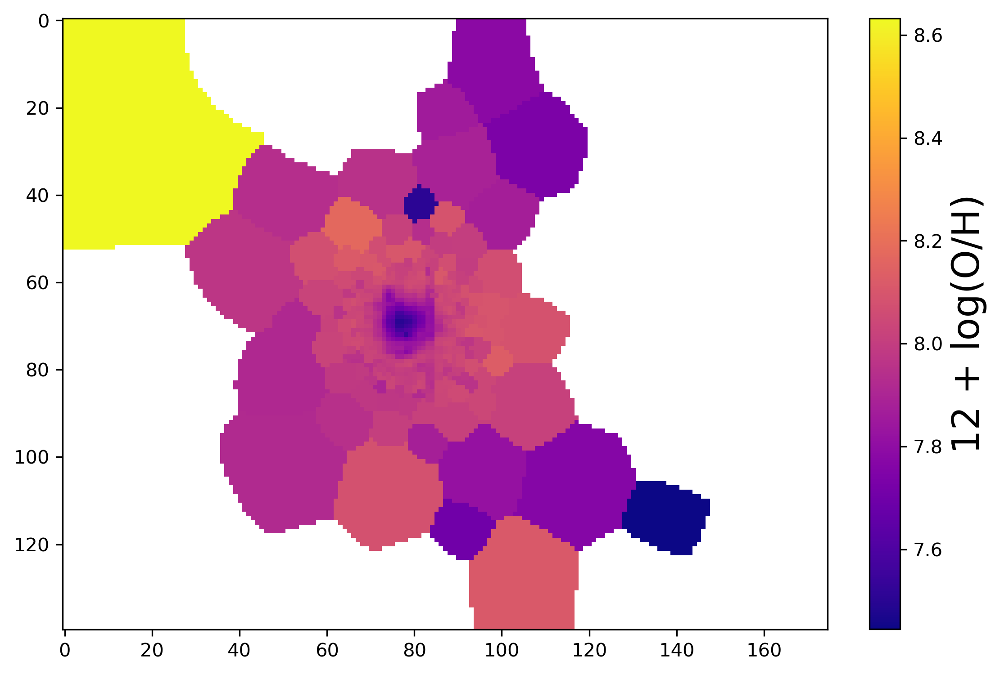
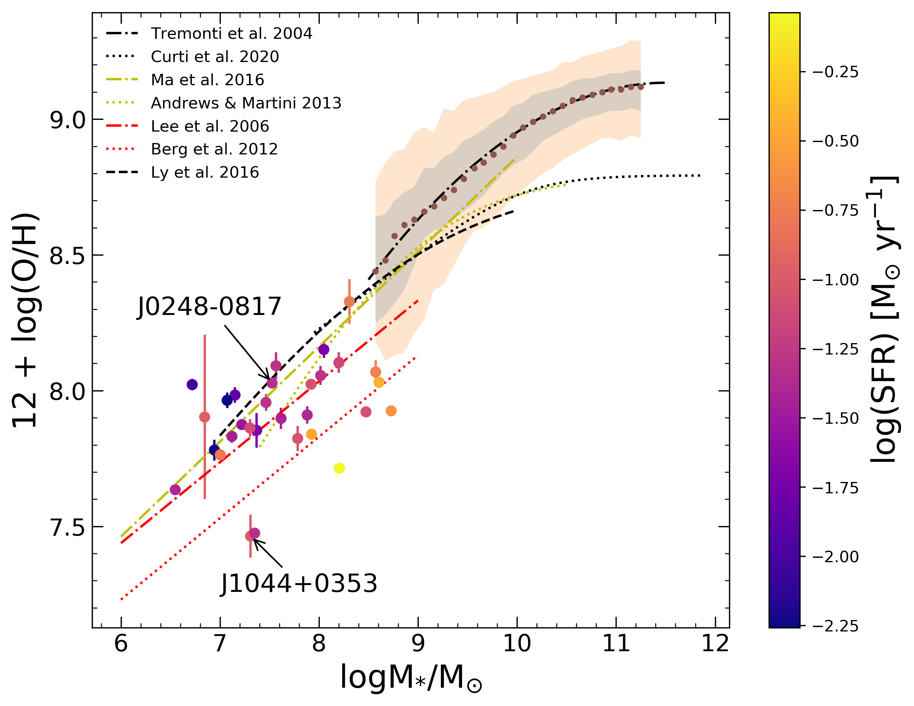
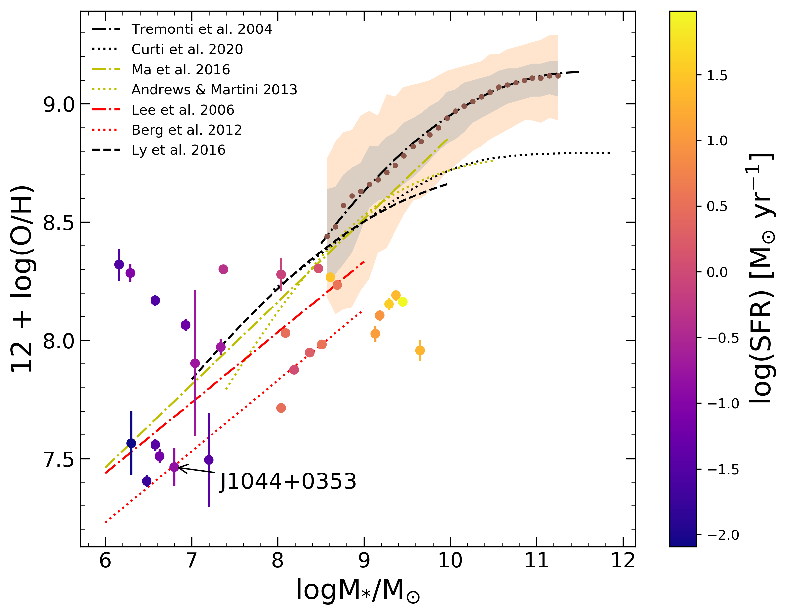

# Zixuan Peng

{:height="20%" width="20%"}

I just finished my undergraduate study at UC Santa Barbara with major in Physics and minor in Astrophysics. I am interested in the fields like interstellar medium and galaxy formation and evoluton, and I am also obsessed with using or constructing theoretical simulations to help me understand how universe works in general. 

## Education Background 

* **Physics Ph.D.**: *University of California, Santa Barbara* (2021-)
* **Physics B.S.**: *University of California, Santa Barbara* (2017-2021)
* **High School**: *Shenzhen Middle School (Advanced Placement Program)* (2014-2017)

## Research Summary

For my senior thesis, I measured nebular density, nebular temperature, and oxygen abundance of SDSS emission-line galaxies. These galaxies are the closest local analogs of the high-redshift galaxies in the epoch of reionization that the James Webb Space Telescope will soon discover and study. During the 2020 Summer, I presented my abundance measurement work at [Kavli Institute for Theoretical Physics Undergraduate Physics Research Symposium!](https://www.dropbox.com/s/0pjjjwytxz01xj1/2020%20Undergraduate%20Physics%20Research%20Symposium%20Program-3.pdf?dl=0). Due to limitation of direct-based oxygen abundance, I also used existing data cubes obtained from KCWI Integral field spectroscopy to map out nebular density, nebular temperature, and oxygen abundance spatially in four low-mass galaxies, J0248-0817, J0823+0313, J1044+0353, and J1238+1009 with high emission-line equivalent width. The figure below shows the oxygen abundance map for J0248-0817:

{:height="50%" width="50%"}

Then, I found out their mass-metallicity relation (color-coded by star formation rate) for our starforming galaxies based on the stellar mass and star formation rate that are obtained from the MPA-JHU Catalog and the NASA-Sloan Atlas.

{:height="40%" width="40%"} {:height="40%" width="40%"}

## BallisLife 

## Contact Info

* **Email**: *zixuanpeng@ucsb.edu*

