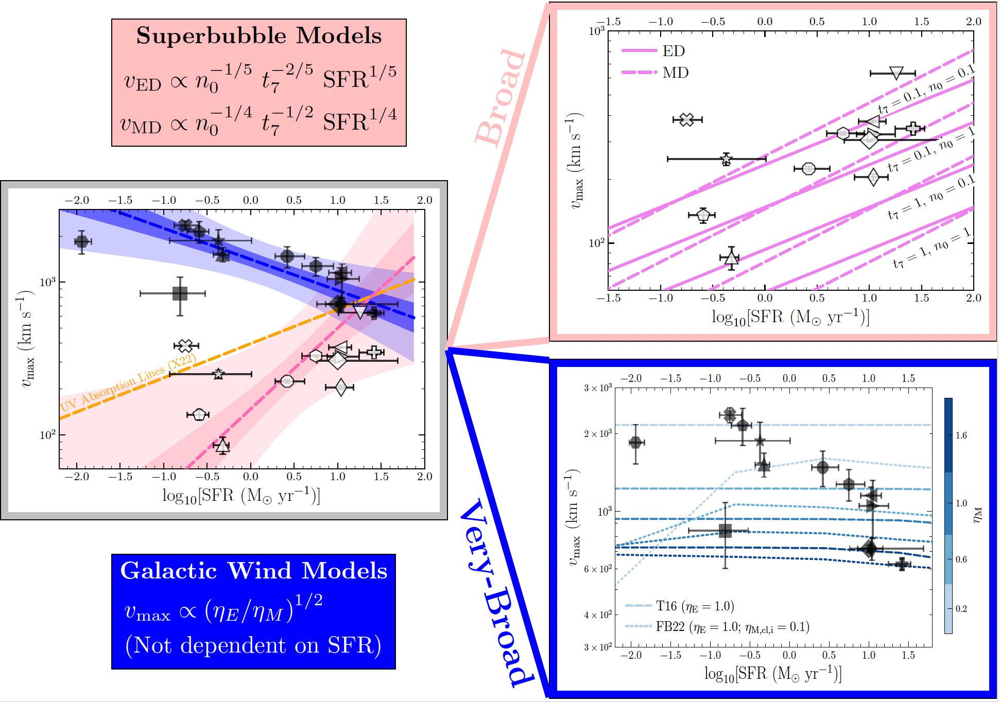

# Physical Origins of Outflowing Cold Clouds in Local Star-forming Dwarf Galaxies [ [arXiv link]](https://arxiv.org/abs/2412.05371) {#esi_galactic_wind}
We study the physical origins of outflowing cold clouds in a sample of 14 low-redshift dwarf (M∗ ≲ 10^10 M⊙) galaxies from the COS Legacy Archive Spectroscopic SurveY (CLASSY) using Keck/ESI data. Outflows are traced by broad (FWHM ~ 260 km s−1) and very-broad (VB; FWHM ~ 1200 km s−1) velocity components in strong emission lines like [O III] λ5007 and Hα. The maximum velocities (vmax) of broad components correlate positively with SFR, unlike the anti-correlation observed for VB components, and are consistent with superbubble models. In contrast, supernova-driven galactic wind models better reproduce the vmax of VB components. Direct radiative cooling from a hot wind significantly underestimates the luminosities of both broad and VB components. A multi-phase wind model with turbulent radiative mixing reduces this discrepancy to at least one dex for most VB components. Stellar photoionization likely provides additional energy since broad components lie in the starburst locus of excitation diagnostic diagrams. We propose a novel interpretation of outflow origins in star-forming dwarf galaxies−broad components trace expanding superbubble shells, while VB components originate from galactic winds. One-zone photoionization models fail to explain the low-ionization lines ([S II] and [O I]) of broad components near the maximal starburst regime, which two-zone photoionization models with density-bounded channels instead reproduce. These two-zone models indicate anisotropic leakage of Lyman continuum photons through low-density channels formed by expanding superbubbles. Our study highlights extreme outflows (vmax ≳ 1000 km s−1) in 9 out of 14 star-forming dwarf galaxies, comparable to AGN-driven winds.

    
     
    <em>Figure 12 in Peng et al. 2025. 
 </em>

[Back to Research](./research.html)
