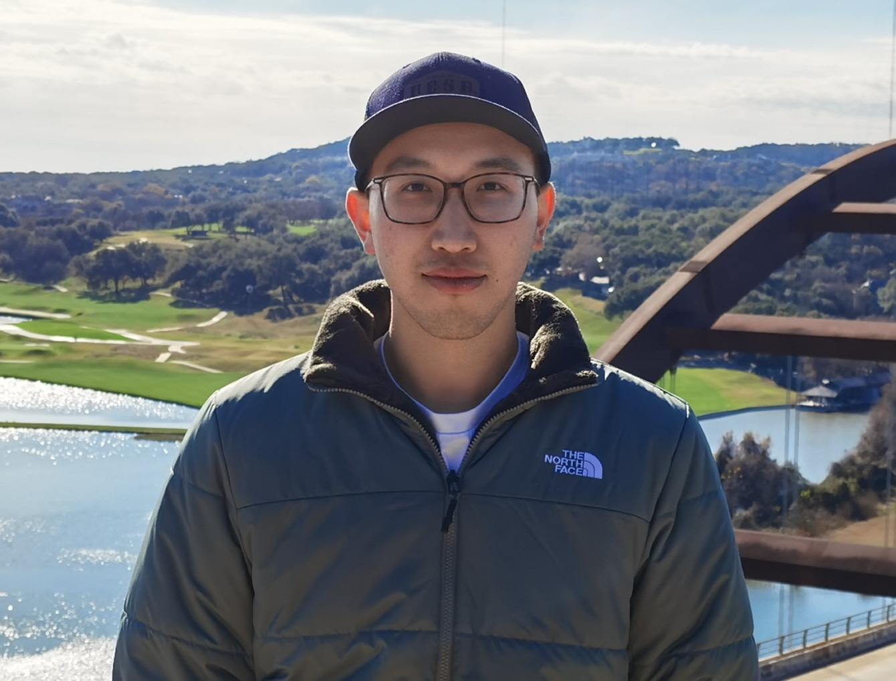

# Welcome to Zixuan Peng (彭子轩)'s Personal Website!

{:height="30%" width="20%"}

Zixuan is a second-year Physics PhD student, with an emphasis in Astrophysics, at the University of California, Santa Barbara (UCSB). Zixuan received the Physics B.S. with a minor in Astronomy from UCSB in 2021. He is interested in the interface between theoretical and observational work in galaxy formation and evolution. His current work is mainly about the chemical evolution of Extreme-Emission-Line Galaxies, local analogs of high-redshift galaxies during the Epoch of Reionization, and galactic wind. 

## Education Background 

* **Physics Ph.D.**: *University of California, Santa Barbara* (2021-)
* **Physics B.S.**: *University of California, Santa Barbara* (2017-2021)
* **High School**: *Shenzhen Middle School* (2014-2017)

Please check my [CV](zixuan_cv.html) for more details.

## Research Summary

1. [Probing the Dynamics and Metal Content of Galactic Winds Through Absorption and Emission Lines](research.html#esi_galactic_wind)
2. [Using KCWI to Explore the Chemical Inhomogeneities and Evolution of an Extreme-Emission-Line Galaxy](research.html#kcwi_1044)

## BallisLife

From the tender age of ten, my heart has been held captive by the rhythm and pulse of basketball. With the school's team, I learned to navigate the court, to mold my movements into the ebb and flow of the game. The role of point guard chose me, whispered to me of a chance to orchestrate the game, to transform chaos into harmony. Every bounce of the ball, every swoosh of the net echoed a promise: there's more to learn, more to achieve. I devoured every piece of wisdom I could find, honing my skills in shooting, passing, defense, and dribbling. Relentless in my pursuit of growth, I challenged those who were stronger, quicker, better. This unyielding spirit was my compass, guiding me towards incremental progress year after year. Basketball was more than a game to me - it was a crucible, a transformative force. It forged my resilience, strengthening both body and spirit. The court became a sanctuary, the game a catalyst for lifelong friendships, relationships woven through shared triumphs, losses, and countless hours of practice. Despite the scars I bear - both my knees bear the toll of ACL surgeries - the love for the game remains unbroken. Each injury was a lesson in humility, a reminder to respect the unforgiving reality of the physical world, and yet to persist, pushing myself to the edge of my potential. The satisfaction in the journey, regardless of the outcome, is a testament to the adage by Romain Rolland: "There is only one heroism in the world: to see the world as it is, and to love it." For a deeper glimpse into my journey through the world of basketball, please click on the [link](ballislife.html). It's a tale of passion, perseverance, and the pursuit of excellence. A journey I'm honored to share.

## Contact Info

* **Email**: *zixuanpeng@ucsb.edu*

#### *Background Image Credit: NASA, ESA and the Hubble Heritage Team (STScI/AURA). Acknowledgment: J. Gallagher (University of Wisconsin), M. Mountain (STScI) and P. Puxley (NSF).*

