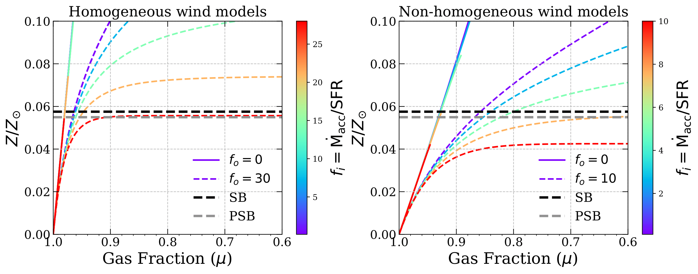
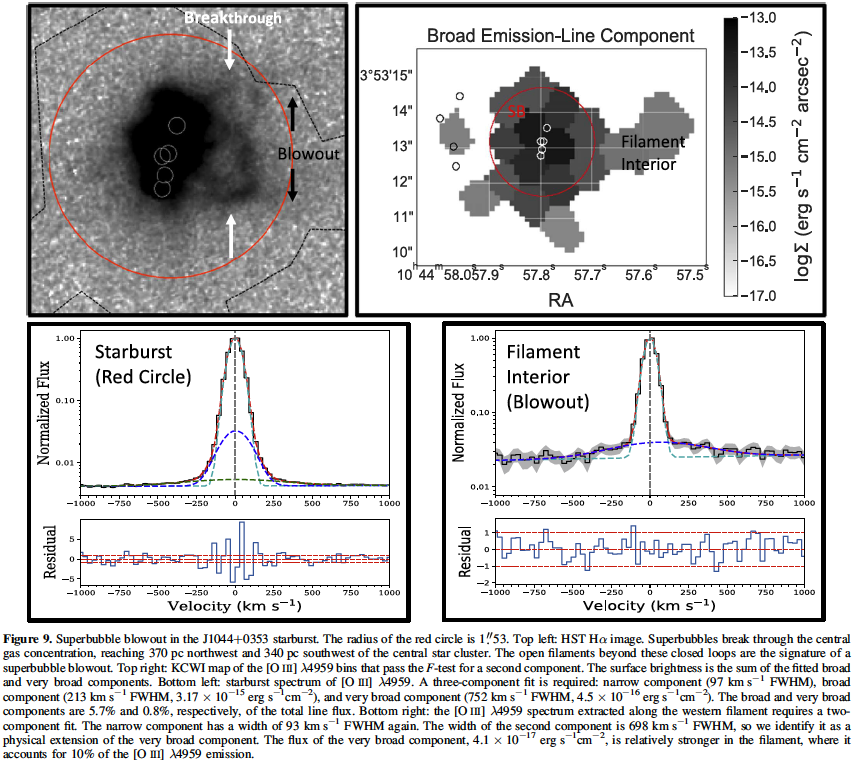

# Resolving the Mechanical and Radiative Feedback in an Extreme-Emission-Line Dwarf Galaxy with KCWI Spectral Mapping [ [arXiv link]](https://arxiv.org/abs/2403.11390) {#kcwi_1044_clm_zp}
We present integral field spectroscopy toward and around J1044+0353, a rapidly growing, low-metallicity galaxy that produces extreme [O III] line emission. A new map of the O32 flux ratio reveals a density-bounded ionization cone emerging from the starburst. The interaction of the hydrogen-ionizing radiation, produced by the very young starburst, with a cavity previously carved out by a galactic outflow, whose apex lies well outside the starburst region, determines the pathway for global Lyman continuum (LyC) escape. In the region within a few hundred parsecs of the young starburst, we demonstrate that superbubble breakthrough and blowout contribute distinct components to the [O III] line profile: broad and very broad emission line wings, respectively. We draw attention to the large [O III] luminosity of the broad component and argue that this emission comes from photoionized, superbubble shells rather than a galactic wind as is often assumed. The spatially resolved He II λ4686 nebula appears to be photoionized by young star clusters. Stellar wind emission from these stars is likely the source of line wings detected on the He II line profile. This broader He II component indicates slow stellar winds, consistent with an increase in stellar rotation (and a decrease in effective escape speed) at the metallicity of J1044+0353. At least in J1044+0353, the recent star formation history plays a critical role in generating a global pathway for LyC escape, and the anisotropic escape would likely be missed by direct observations of the LyC.

<!-- {:height="40%" width="40%"} -->

    

[Back to Research](./research.html)
