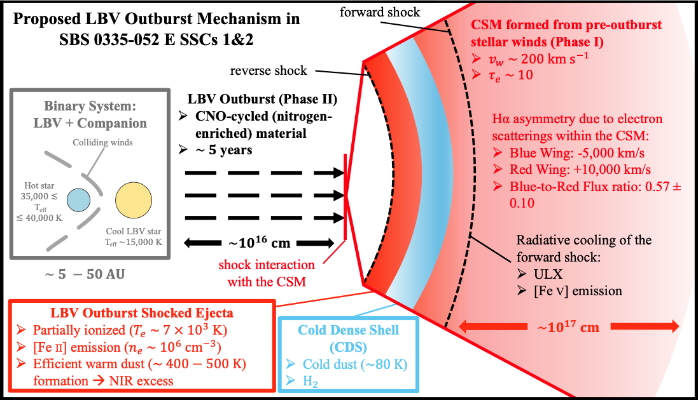

# When Stars Mimic Monsters: Luminous Blue Variables in SBS 0335-052 E [ [arXiv link]](https://arxiv.org/abs/2508.03912) {#lbv_in_sbs_0335}
Recent studies have claimed the detection of an active massive black hole (BH) in the low-metallicity blue compact dwarf galaxy SBS 0335-052 E based on near-infrared (NIR) time variability and broad Hα wings. This interpretation remains questionable given the observed broad wings in forbidden [O III] emission. Based on spectroscopic properties derived from our KCWI/KCRM integral-field observation of super star clusters 1 and 2 (SSCs 1&2), we propose instead that these BH signatures originate from a luminous blue variable (LBV) outburst in a binary system like η Carinae. First, the [Fe II] emission-line ratio and detected O I 8446 pumped emission require high-density gas (ne∼10^6 cm−3). This dense gas resides in the circumstellar medium (CSM) formed by pre-outburst stellar winds. Subsequent shock interaction between the LBV outburst ejecta and CSM efficiently produces warm dust and the corresponding NIR excess. Second, SSCs 1&2 are nitrogen-enriched relative to other SSCs. This enrichment arises from ejections of CNO-cycled material by multiple LBV outbursts. Third, we detect asymmetric broad Hα wings extending from ∼−5000 to ∼10000 km s−1. This asymmetry results from electron scattering in the expanding, optically thick CSM. The proposed CSM shock interaction naturally explains the luminosities of [Fe V] and ultra-luminous X-ray emission. Contrarily, [Fe II] and [Fe IV] emission originates primarily from gas photoionized by the cool primary LBV and hot secondary stars, respectively. Our results highlight how the shock interaction of massive stars with high-density CSM mimics active massive BH signatures in low-metallicity dwarf galaxies.

    
     
    <em>Figure 10 in Peng et al. 2025. 
 </em>

[Back to Research](./research.html)
