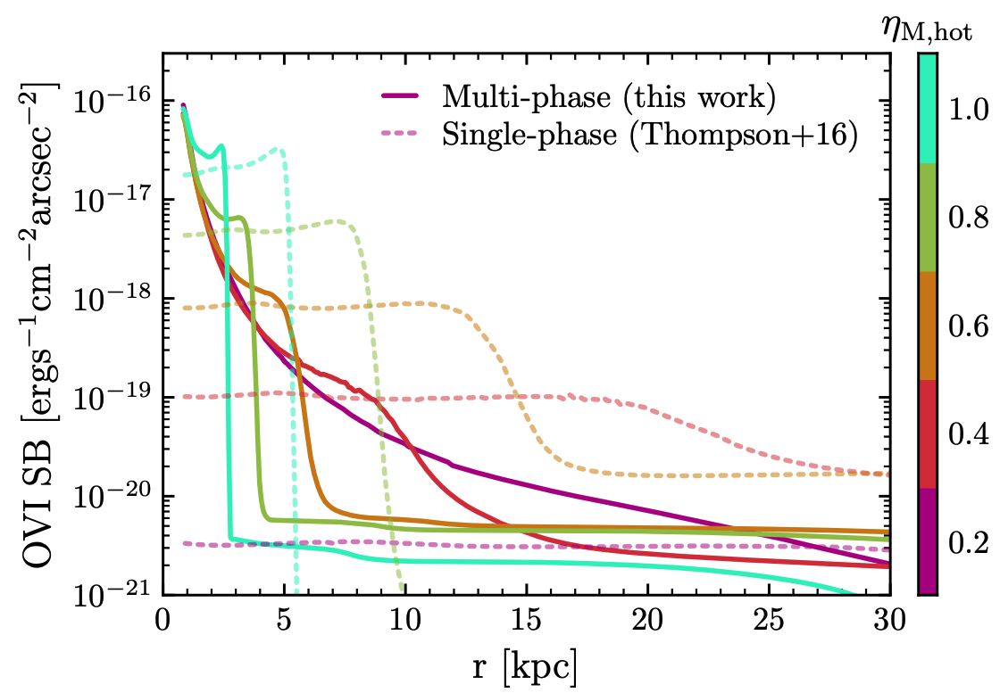

# Modeling Emission-Line Surface Brightness in a Multiphase Galactic Wind: An O VI Case Study [ [arXiv link]](https://arxiv.org/abs/2510.02443) {#winterphase_em_sb}
We present a fast and robust analytic framework for predicting surface brightness (SB) of emission lines in galactic winds as a function of radius up to ∼100 kpc out in the circum-galactic medium. We model multi-phase structure in galactic winds by capturing emission from both the volume-filling hot phase (T ∼10^{6−7} K) and turbulent radiative mixing layers that host intermediate temperature gas at the boundaries of cold clouds (T ∼10^4 K). Our multi-phase framework makes significantly different predictions of emission signatures compared to traditional single-phase models. We emphasize how ram pressure equilibrium between the cold clouds and hot wind in supersonic outflows, non-equilibrium ionization effects, and energy budgets other than mechanical energy from core-collapse supernovae affect our SB predictions and allow us to better match OVI observations in the literature. Our framework reveals that the optimal galactic wind properties that facilitate OVI emission observations above a detection limit of ∼10^{−18} erg s−1 cm−2 arcsec−2 are star formation rate surface density 1 ≲ Σ∗ ≲ 20 M⊙ yr−1 kpc−2, hot phase mass loading factor ηM,hot∼0.2−0.4, and thermalization efficiency factor ηE≳0.8. These findings are consistent with existing observations and can help inform future target selections.

    
     
    <em>Figure 1 in Chen & Peng et al. 2025. 
 </em>

[Back to Research](./research.html)
